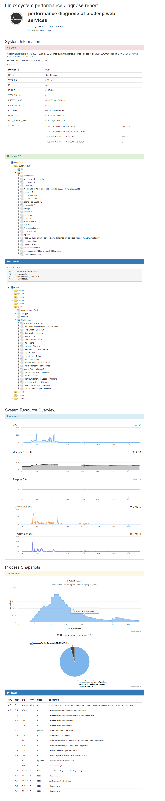

# linux-profiler
Linux system performance profiler tool

# Usage

1. Run on your linux system

```bash
# first give the executative permission to the bash script
chmod +x ./linux-profiler

# and then you can run the tool in bash like:
# view command helps
./linux-profiler

# // 
# // 
# // 
# // VERSION:   1.0.0.0
# // ASSEMBLY:  linux-profiler, Version=1.0.0.0, Culture=neutral, PublicKeyToken=null
# // COPYRIGHT: Copyright (c)  2020
# // GUID:      86c11939-c5f0-4678-a09e-2f5dfcc96d32
# // BUILT:     1/1/2000 12:00:00 AM
# // 
#
#
# < cli.Program >
#
#
# SYNOPSIS
# linux-profiler command [/argument argument-value...] [/@set environment-variable=value...]
#
# All of the command that available in this program has been list below:
#
# /report:     
# /run:        Run benchmark test
#
#
# ----------------------------------------------------------------------------------------------------
#
#   1. You can using "linux-profiler ??<commandName>" for getting more details command help.
#   2. Using command "linux-profiler /CLI.dev [---echo]" for CLI pipeline development.
#   3. Using command "linux-profiler /i" for enter interactive console mode.

# run this tool for logging the system performance data
./linux-profiler /run /save ./samples.zip /title "title blablabla..." /interval 15
```

2. Create the diagnose report

```bash
./linux-profiler /report /snapshots ./samples.zip /template /path/to/template_directory /out /path/to/report_directory
```


